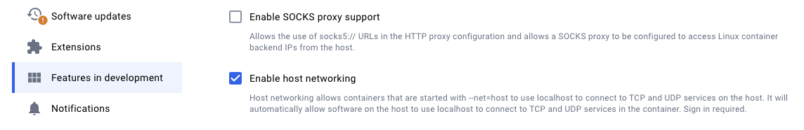
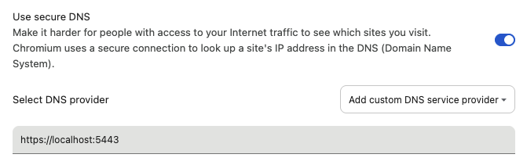
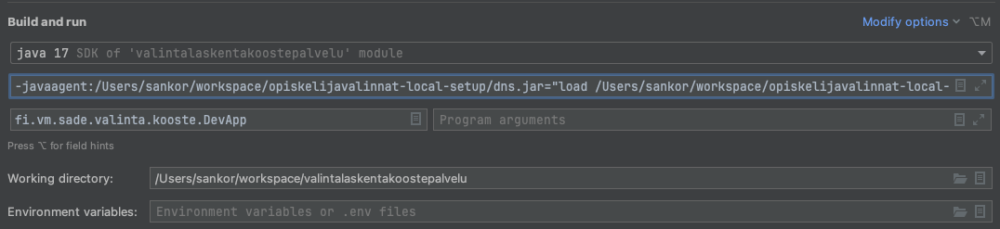

## Useamman palvelun ajaminen lokaalisti kehitysympäristöä vasten

### Taustaa

Tämä projektin tarkoitus on mahdollistaa lokaalin kehittämisen setuppi jossa osaa palveluista ajetaan lokaalisti niin että
ne kutsuvat toisiaan suoraan, ja käyttävät muilta osin jonkin ympäristön (hahtuva, untuva, pallero) tietokantoja ja
muita palveluita. Palvelut voivat olla sekä taustapalveluita (esim. valintalaskenta) että käyttöliittymiä (esim. valintalaskenta-ui).
Olennainen rajoitus on, että testiympäristön (hahtuva, untuva, pallero) palvelut kutsuvat luonnollisesti suoraan toisiaan.
Jos siis halutaan ajaa lokaalisti esim. valintalaskentaa, täytyy myös valintalaskennan käynnistämiseen liittyviä palveluita
(valintalaskentakoostepalvelu) ajaa lokaalisti.

### Tekninen lähestymistapa

Projektin tarkoituksena on mahdollistaa useamman palveluiden ajaminen lokaalisti toisiaan vasten mahdollisimman pienillä
muutoksilla verrattuna yksittäisen palvelun ajamiseen lokaalisti jotain kehitysympäristöä vasten. Tämä perustuu seuraavaan
lähetysmistapaan:

1. Konfiguroidaan yksittäiset palvelut (lähes) normaalisti kuten niitä ajettaisiin kehitysympäristöä vasten, esim: a)
kantayhteyksiä varten on tehty putket bastionin kautta, ja b) base-urlit on konfiguroitu osoittamaan haluttuun
testiympäristöön (esim. virkailija.hahtuvaopintopolku.fi). Ajo testiympäristöjä vasten pitäisi olla dokumentoitu yksittäisten
palveluiden ohjeissa.


2. Ajetaan lokaalisti nginx-instanssia joka ohjaa kutsut lokaalisti ajettaviin palveluihin localhostiin oikeisiin portteihin ja
loput palvelut edelleen kehitysympäristön palveluihin


3. Konfiguroidaan lokaalista ajettavien palveluiden JVM:ät niin että testiympäristojen hostit resolvataan localhostiin ja jvm
hyväksyy lokaalin nginx:in self-signed sertifikaatin


4. Konfiguroidaan jokin lokaali selain niin että kehitysympäristön urleihin tehdyt kutsut ohjataan lokaaliin nginxiin, ja
nginxin ja dns-palvelimen sertifikaattiongelmista ei valiteta.

Tämän lähestymistavan avulla:

1. Kutsut ohjautuvat lokaaleihin ja kehitysympäristön palveluihin ilman palveluihin tehtävää avainkohtaista konfiguraatiota


2. Kaikki lokaalit ja testiympäristöön menevät palveluiden väliset kutsut menevät nginxin kautta, jolloin niitä voi seurata
nginxin lokilta


3. Kehitysympäristön hosteja ei tarvitse lisätä hosts-tiedostoon, jolloin toisella selaimella voi suorittaa kehittämisen tai
testauksen vaatimia toimenpiteitä suoraan kehitysympäristön palveluihin

### Konfiguraatio

1. Aja ./fetch-jar.sh joka downloadaa dns-manipulaatiokirjaston

2. Enabloi Docker Desktopin host-networking -feature (tähän tarvitaan vähintään version 4.29.0) kohdasta Settings ->
Features in Development -> "Host Networking". Tämä toimenpidettä ei tarvita jos käytät Dockeria (ei Docker Desktopia)
Linuxilla. Host networking -toimintoa tarvitaan jotta nginx voi ohjata liikennettä takaisin host-ympäristössä oleville
lokaaleille palveluille.




3. Konfiguroi nginx ohjaamaan lokaalisti ajettavat palvelut lokaaleihin portteihin. Tämä tehdään muuttamalla tiedostoa
docker/nginx/localhost.conf. Tiedosto sisältää muutaman esimerkin. Portti on luonnollisesti palvelukohtainen ja riippuu
siitä miten tämän palvelun lokaali kehitys on järjestetty.


4. Käynnistä lokaali dns ja nginx ajamalla docker-hakemistossa:

``` shell
docker compose up --build
```


5. Asenna (tarvittaessa) ja käynnistä Chrome tai Chromium (Chromium on suositeltava jotta on aina selvää mikä selain on
turvaton ja testikäytössä) komennolla:

``` shell
<polku chromiumiin> --ignore-certificate-errors-spki-list=03dAvyIQd5sFgZCQeVflkFZ128s053+MzPMZxnoSIro= --user-data-dir=<esim. ~/test_user>
```

Näin käynnistettynä Chromium ei valita dns-palvelimen tai nginxin self-signed sertifikaatista, ja tallentaa asetukset sekä
datan erilliseen hakemistoon niin ettei se vaikuta varsinaiseen Chrome-instanssiin. HUOM! Vaikka muita sertifikaatteja
käsitellään normaalisti, on silti suositeltavaa ettei tällä selaimella hoideta pankkiasioita tai selailla muutenkaan internettiä!
MacOs:ssä Chromium-polun voi selvittää komennolla "whereis chromium".


6. Configuroi käynnistetty Chromium käyttämään custom DNS over HTTPS -palvelinta kohdasta Settings -> Privacy and Security
enabloimalla "Use Secure DNS" ja laittamalla kohtaan "Select DNS Provider" choose "Add custom DNS service provider" arvo
https://localhost:5443. Näin opintopolkuliikenne ohjautuu lokaaliin nginxiin.




7. Lisää seuraavat JVM-parametrit lokaalisti ajettaviin palveluihin:

``` shell
-javaagent:<tämän projektin hakemisto>/dns.jar="load <tämän projektin hakemisto>/dns-cache.properties" -Djavax.net.ssl.trustStore=<tämän projektin hakemisto>/cacerts --add-opens java.base/java.net=ALL-UNNAMED
```

Javaagent-parametri käynnistää agentin joka yliajaa dns-konfiguraatiot, trustStore-parametri saa JVM:än käyttämään
truststorea joka sisältää nginxin käyttämän self-signed sertifikaatin, ja --add-opens tarvitaan dns-agentin ajamiseksi
kun jvm versio on 9+. IDEA:ssa jvm-parametrit saadaan esiin Run tai Debug -konfiguraatioon kohdasta Modify Options ->
VM Options.




8. Käynnistä lokaalit palvelut. Palveluiden välisten kutsujen pitäisi nyt näkyä docker compose -ikkunassa nginx-lokilla.


9. Avaa testiselaimella virkailijan käyttöliittymä (esim. virkailija.hahtuvaopintopolku.fi) ja kirjaudu sisään. Nginx-
konfiguraatiosta riippuen osa käyttöliittymästä (esim. /valintalaskenta-ui) ajetaan lokaalisti ja loput tulevat
varsinaisesta testiympäristöstä. Myös selaimesta lähtevät kutsut eri palveluihin menevät joko testiympäristöön tai
lokaaliin konfiguraatiosta riippuen.